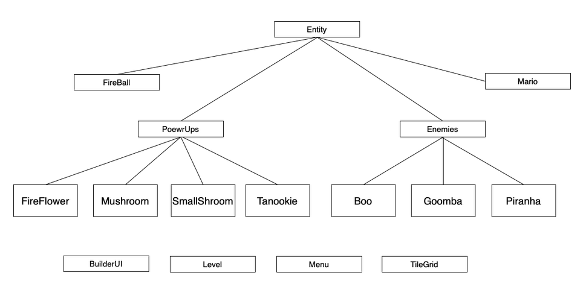

# Mario Maker


### Introduction 

Our project was inspired by the video game, Super Mario MakerTM. However, OUR Mario Maker runs on PC and is more ✨personalized✨. Our primary goal with this project is to provide a creative space where users can challenge themselves and share their talents, all while having fun. 


## Team 
> Nicholas Phillips (nwp2@illinois.edu)
>
> Jeewon Koo (jeewonk2@illinois.edu)
> 
> Elaine Cai (ewcai2@illinois.edu)
> 
> Rendy Harris (rendyh2@illinois.edu)

## Description 

Mario is a game that many people enjoy, but with Mario Maker, people are allowed to create their own levels with infinite possibilities and share them with the world. The goal is to provide a creative space where people can challenge and share their talents, all while having fun.


## Functionality 

#### Play mode: Users are able to play 2d platforming levels
#### Make mode: Users are able to create their own levels
#### Save mode: Users are able to save and load levels from files
#### Enemies: Enemies for the user to fight/avoid
#### PowerUps: Users can collect power ups that will change the behavior of the character

## Installation Instructions

<div align=center>

</br></br>
</br>
```
git submodule update --init --recursive
mkdir build && cd build
cmake ..
make mario_maker
```
</br>

```
git submodule update --init --recursive
mkdir build && cd build
cmake ..
make mario_maker
```

</div>

### Group Roles

Each member worked together to contribute to the overall code, but we also split our work based on specializations and specific features:
> Rendy focusing more on test cases
> 
> Nick on json features like saving and loading as well as overall movement of sprites
> 
> Elaine on UI and making sprites
>
> Jeewon on documentation and sprites


#
Game Architecture:

course-project-pb-b created by GitHub Classroom

